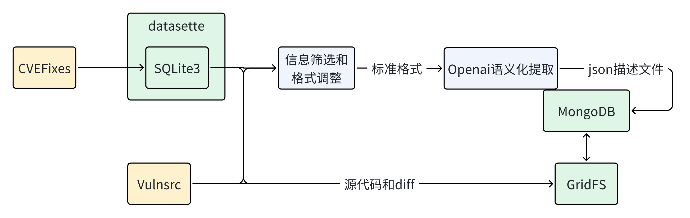
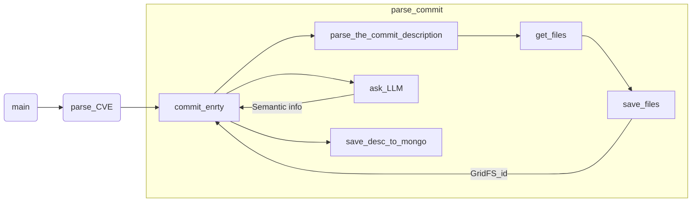

# CVEFixFormatter

CVEFixFormatter is a lightweight tool for transforming CVEfix dataset into customized formats for data analysis, visualization, or integration into other applications. It provides a seamless way to preprocess, clean, and structure vulnerability and fix data for research or practical use.



我们的数据集来源于两个项目,分别是CVEFix(Link Required)和[VulnCodeCollector](https://github.com/iridium-soda/VulnCodeCollector).我们分别对这两个项目进行处理和清洗.以提取高级语义化的信息.并存入mongodb中.

## CVE formatter

该功能从[VulnCodeCollector](https://github.com/iridium-soda/VulnCodeCollector)中自动化解析并提取CVE信息，自动由大模型生成语义化信息并存入mongodb中。

### Install

Initialize mongo container

```shell
docker run -d --name cve-mongodb -p 27017:27017 \
  -v [mount point]:/data/db \
  mongo --noauth
```

Clone VulnCodeCollector

```shell
git clone https://github.com/iridium-soda/VulnCodeCollector.git
```

Run

```shell
conda activate cveformatter
python3 vulnsrc_formatter.py --help
```

### Config

> [!tip]  
> 本项目采用基于 Ollama 的 Qwen2.5Code 模型对代码进行语义清洗，暂时只支持Ollama标准的API接口。如有需要请在`utils/providers`中进行编写并修改源代码。

生成项目配置文件：

```shell
cp config.example.yaml config.yaml
```

打开 `config.yaml` 文件，根据当前可用的大模型提供商进行适配和调整。确保配置符合实际需求，以便正常使用项目功能。

### Run

Usage:

```plaintext
 Usage: vulnsrc_formatter.py [OPTIONS]                 
                                                       
╭─ Options ───────────────────────────────────────────╮
│ *  --repo-path         TEXT     The path of Vulsrc  │
│                                 repo's root path    │
│                                 [default: None]     │
│                                 [required]          │
│    --mongo-host        TEXT     The host address of │
│                                 the mongodb         │
│                                 [default:           │
│                                 127.0.0.1]          │
│    --mongo-port        INTEGER  The port of the     │
│                                 mongodb port        │
│                                 [default: 27017]    │
│    --help                       Show this message   │
│                                 and exit.           │
╰─────────────────────────────────────────────────────╯
```

### Flow


